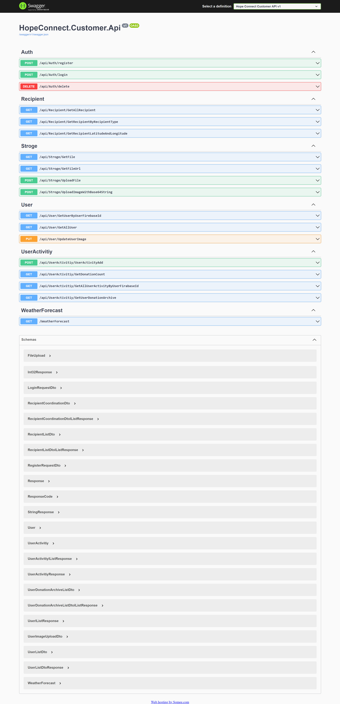

 

  

  <h3 align="center">Hope Connect Api</h3>

  

    Let's Reach More People Together, Let's Spread More Hope Together: HopeConnect!
     
     
    <a href="https://github.com/HopeConnect/HopeConnect.Api"><strong>Explore the docs »</strong></a>
     
     
    <a href="https://github.com/HopeConnect/HopeConnect.Api">View Demo</a>
    .
  

## Table Of Contents

* [About the Project](#about-the-project)
* [Built With](#built-with)
* [Getting Started](#getting-started)
* [Contributing](#contributing)
* [Authors](#authors)

## About The Project

HopeConnect is a platform created to address urgent issues such as homelessness, hunger, and lack of education faced by millions of people worldwide. The project aims to alleviate difficulties in accessing basic needs and provide support to individuals struggling with these issues.

At its core, HopeConnect is shaped by a deeply emotional sense of responsibility and solidarity. The platform supports collective efforts to ensure universal basic human rights. It serves as a source of hope where individuals from all walks of life come together to extend a helping hand and create a positive impact globally.

The technology infrastructure behind HopeConnect has been carefully designed to ensure the project's goals are achieved. Strong and reliable backend development using ASP.NET Core 8 forms the backbone of the platform. Microsoft SQL Server is preferred for storing and processing data, while modern cloud technologies like Google Cloud Storage and Firebase are utilized to enhance user experience and accessibility.

Through the integration of these technologies, HopeConnect offers users an easily accessible, secure, and user-friendly platform. This facilitates rapid and effective support for those in need, aiming to bring about positive change and improvement worldwide.

HopeConnect specifically focuses on the Sustainable Development Goals outlined by the United Nations, including Zero Hunger, No Poverty, and Quality Education. By addressing these goals, the platform aims to provide solutions to issues such as hunger alleviation, poverty reduction, and increased access to education.

## Built With

Built With HopeConnect: Empowering Change Through Technology

HopeConnect is a platform designed to address urgent issues such as homelessness, hunger, and lack of education faced by millions of people worldwide. The primary goal of this project is to alleviate difficulties in accessing basic needs and provide support to individuals struggling with these issues. To achieve this goal, HopeConnect utilizes various technologies:

ASP.NET Core 8: ASP.NET Core 8 is used to build a robust and reliable backend infrastructure. This ensures the platform operates smoothly and provides users with an efficient experience. Additionally, ASP.NET Core 8's n-layered architecture enables the application to be modular and easily extensible.

Microsoft SQL Server: Microsoft SQL Server is chosen for data storage and processing. This plays a crucial role in ensuring the security and integrity of the platform's data.

Google Cloud Storage: Google Cloud Storage is used for storing and managing files uploaded by users. This enhances the platform's scalability and data accessibility.

Firebase: Firebase integration is employed to enhance user experience and make the platform more accessible. Firebase offers various features such as session management, notifications, and user analytics, thereby increasing the platform's effectiveness.

Google Maps Platform: In addition to the aforementioned technologies, Google Maps Platform is integrated into the project. This provides users with location-based services, facilitating access to local resources. For example, Google Maps Platform is used to display aid points on the map and enable users to access nearby aid resources.

HopeConnect aims to provide users with a secure, accessible, and effective platform for assistance. By integrating these technologies, we believe we are taking a significant step towards bringing about positive change and improvement worldwide.

## Getting Started

HopeConnect Local Installation Instructions

These instructions outline the steps to set up a local copy of HopeConnect. To run the project locally, you need to configure your development environment properly.

* Requirements:

1. .NET Core SDK: Required for developing and running .NET Core projects.

2. Visual Studio IDE or Visual Studio Code: You can use either of these for project development. Visual Studio Community Edition is free and sufficient for developing and running the project.

3. Microsoft SQL Server: Required for hosting the project's database. You can use the free Express Edition. You can download it from this link.

4. Google Cloud Platform (GCP) Account: If the project utilizes services like Google Cloud Storage, you'll need a GCP account to create API keys and access. You can create an account and manage API access from here.

* Installation Steps:

1. Clone or fork the project repository from GitHub.

2. Open Visual Studio IDE or Visual Studio Code and navigate to the project folder.

3. Open the Package Manager Console and run the following command to create migrations for the database:

dotnet ef migrations add InitialCreate

4. Apply the migrations to the database by running the following command:

         dotnet ef database update

5. Add API keys and credentials for services like Google Cloud Storage and Firebase.

6. Open a terminal or command prompt in the project folder and run the following command to start the project:

          dotnet run
7. Visit http://localhost:5000 in your web browser to access your local copy of HopeConnect.

By following these steps, you can set up a local instance of HopeConnect and test the project in your local environment. Make sure to carefully review each step and check for any errors or issues as you proceed.

## Contributing

We welcome contributions to improve and enhance HopeConnect. To contribute, follow these steps:

1. Fork the Project
Fork the HopeConnect repository to your GitHub account by clicking the "Fork" button at the top-right corner of the repository page.

2. Create your Feature Branch
Create a new branch for your feature using the following command:
            ``
      git checkout -b feature/YourFeatureName
        ``
3. Commit your Changes
Make your desired changes to the project and commit them using the following command:
           ``
         git commit -am 'Add: Your changes here'
          ``
4. Push to the Branch
Push your changes to your forked repository on GitHub using the following command:
        ``
         git push origin feature/YourFeatureName
          ``
5. Open a Pull Request
Go to the GitHub page of your forked repository and click on the "New Pull Request" button. Fill out the necessary information, including a descriptive title and a summary of your changes.
Once your pull request is reviewed and approved, it will be merged into the main project.

* Code Style Guidelines
Please adhere to the project's code style guidelines and conventions when making contributions. Ensure that your code is well-documented and follows best practices.

* Issue Tracker
If you encounter any bugs, issues, or have feature requests, please open an issue on the project's GitHub repository. Provide detailed information about the problem or suggestion to help us address it effectively.

* License
By contributing to HopeConnect, you agree that your contributions will be licensed under the MIT License of the project.

## Authors

* **Serkan Özbey Kurucu** - *JR. Software Developer* - [Serkan Özbey Kurucu](https://github.com/serkanozbeykurucu/) - **
* **Mustafa Özvardar** - *JR. Full Stack Software Developer* - [Mustafa Özvardar](https://github.com/mustafaozvardar/) - **

